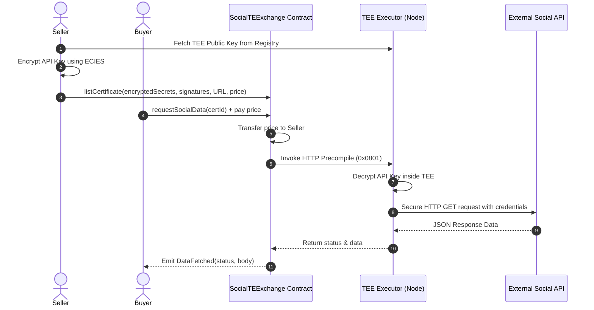

# Social TEE Exchange (SocialTEExchange)

A decentralized, TEE-secured marketplace built on **Ritual Chain** (Chain ID: `1979`) for selling and purchasing access to private Social Network APIs.

The platform leverages **ECIES (Elliptic Curve Integrated Encryption Scheme)** to encrypt sensitive API keys off-chain, ensuring that they can only be decrypted and used inside a verified **Trusted Execution Environment (TEE)** node. The exchange contract interacts with Ritual's native **HTTP precompile (`0x0801`)** to execute queries without exposing the API keys.

---

## 🌟 Features

- **End-to-End Encryption:** API credentials (e.g. Twitter API keys) are encrypted with the TEE node's public key before listing.
- **On-Chain Signature Verification:** Only the authorized owner/seller can grant access, enforced via EIP-191 signatures verified on-chain.
- **TEE HTTP Precompile (`0x0801`):** Safely triggers external API requests from the smart contract via the TEE executor.
- **RitualWallet Lock Mechanism:** Deposits and locks native RITUAL to cover TEE executor transaction and gas fees.
- **Robust Security:** Zero hardcoded private keys or secrets. Includes a production-ready `.gitignore`.

---

## 🏗️ Architecture Flow



---

## 📍 Deployed Contracts

| Component | Network | Address |
| :--- | :--- | :--- |
| **SocialTEExchange** | Ritual Chain | `0x99B688d84abe81800e3F3991Ad7Fe62aCdA40a6a` |
| **RitualWallet** | Ritual Chain | `0x532F0dF0896F353d8C3DD8cc134e8129DA2a3948` |
| **TEE Service Registry** | Ritual Chain | `0x9644e8562cE0Fe12b4deeC4163c064A8862Bf47F` |

---

## 🚀 Getting Started

### 1. Installation

Clone the repository and install all dependencies:

```bash
npm install
```

### 2. Configure Environment Variables

Create a `.env` file (which is ignored by Git) in the root directory and add your private key:

```env
PRIVATE_KEY=0x...
```

### 3. Compile Contracts

To compile the smart contracts using Hardhat:

```bash
npm run compile
```

### 4. Running Unit Tests

Run local test suites to verify listing, toggling, and price updates:

```bash
npm run test
```

---

## 🛠️ Usage Scripts

We have provided several TypeScript scripts under `scripts/` to interact with the deployed contract and audit on-chain states.

### Check Wallet Balances
Check your native RITUAL balance and RitualWallet fee lock status:
```bash
PRIVATE_KEY=$PRIVATE_KEY npm run balance
```

### Deposit & Lock Fees
Deposit and lock RITUAL into `RitualWallet` to cover precompile execution fees:
```bash
PRIVATE_KEY=$PRIVATE_KEY npm run deposit
```

### List a Social Certificate
Register an API endpoint on-chain (this automatically fetches TEE node public key, encrypts credentials, signs EIP-191 message, and lists it):
```bash
PRIVATE_KEY=$PRIVATE_KEY API_KEY="your-api-key" API_URL="https://api.coingecko.com/api/v3/simple/price?ids=ethereum&vs_currencies=usd" npm run list-cert
```

### View Listed Certificates
View all certificates registered on the exchange contract:
```bash
PRIVATE_KEY=$PRIVATE_KEY npm run view-certs
```

### Purchase & Query Social Data
Purchase access to a certificate and execute the secure API request:
```bash
PRIVATE_KEY=$PRIVATE_KEY CERT_ID=0 npm run buy-data
```

### Audit All Network Addresses
Run a complete audit of all deployed contracts, EOA balances, and TEE node configurations:
```bash
npx hardhat run scripts/check-all-addresses.ts --network ritual
```

---

## 🔒 Security & Git Configuration

To prevent credentials from being leaked, a custom `.gitignore` is provided at the root which automatically ignores:
- `node_modules/`
- `artifacts/` & `cache/` (compiled ABI structures)
- `typechain-types/`
- `.env` and `*.env` files containing private keys
